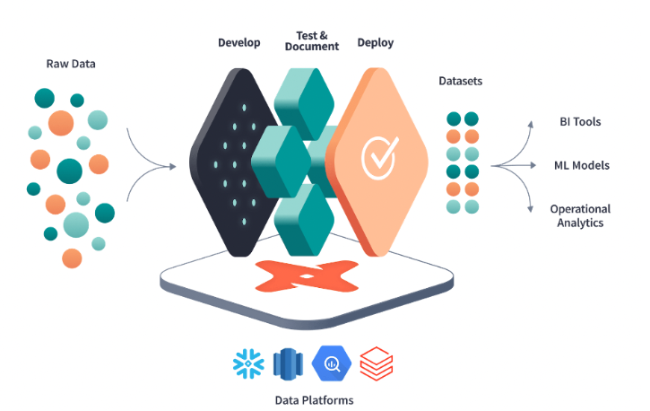
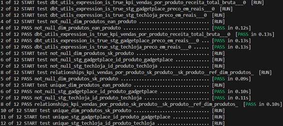
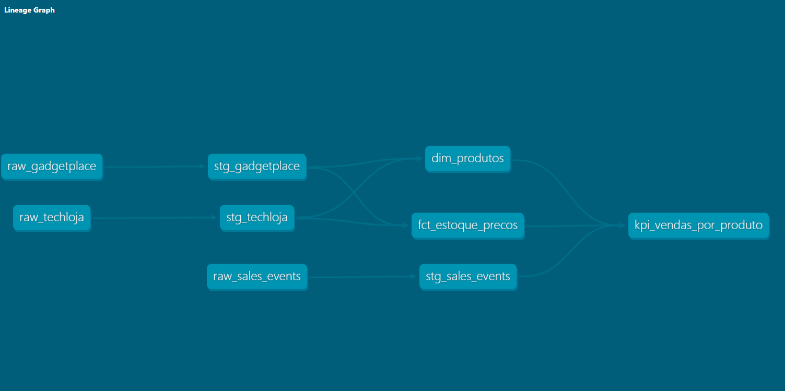
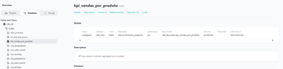

# dbt-ecommerce-analytics

**Um projeto de pipeline de dados completo usando DBT, Docker e Postgres para transformar dados brutos e "sujos" de e-commerce em KPIs confiáveis e prontos para análise.**

---

## 🎯 O Problema: A Dor que Solucionamos

No cenário inicial, um analista de dados recebe três arquivos CSV de fontes diferentes e uma tarefa simples: "Qual é a nossa receita total por produto?"

O analista não consegue responder a essa pergunta em minutos. Ele passará dias sofrendo, pois:

* **Os Dados são Sujos:** Os preços são strings (`"R$ 3.999,90"`, `"3150.00"`), exigindo limpeza manual e complexa.
* **Os Dados não são Confiáveis:** Encontramos preços negativos e IDs de produtos duplicados nas fontes.
* **Os Dados não são Integrados:** O `id_produto` da TechLoja não é o mesmo do GadgetPlace. O EAN/Barcode é a única chave, mas os nomes dos produtos diferem.
* **O Processo não é Replicável:** O analista faria essa limpeza em um script Python ou em um Excel. Se os CSVs mudarem amanhã, todo o trabalho manual precisa ser refeito.

> **A Dor:** O tempo do analista é gasto em **limpeza de dados**, em vez de **geração de insights**. A empresa não tem confiança nos números.

---

## 🚀 A Solução: Uma Fábrica de Dados Confiáveis

Este projeto não é apenas um script SQL. É uma **fábrica de dados (pipeline)** que transforma automaticamente o "lixo" da fonte em "ouro" analítico.

A solução pega os CSVs brutos e entrega tabelas limpas, testadas e prontas para o consumo (`marts`). Quando o analista acessa o banco de dados, ele não vê a sujeira. Ele vê apenas as tabelas finais:

* `dim_produtos`: Uma lista mestra de produtos, limpa e com nomes padronizados.
* `fct_estoque_precos`: Um histórico de preços e estoque.
* `kpi_vendas_por_produto`: Uma tabela pré-calculada com a receita bruta por produto.

O analista agora responde a pergunta em **minutos**, não em dias.

### Como o DBT resolveu isso?

* **Testes (`dbt test`):** O pipeline **para automaticamente** se dados sujos (como preços negativos ou IDs duplicados) forem detectados na fonte. Para garantir que apenas dados válidos cheguem ao analista.
    
    

* **Transformação em Camadas (`staging`, `marts`):** Isolei a lógica. A camada `staging` limpa a sujeira. A camada `marts` constrói os modelos de negócio.

* **Performance (`incremental`):** O histórico de preços (`fct_`) não é reconstruído do zero. Usei materialização incremental para processar **apenas** os dados novos, tornando o pipeline escalável.

* **Documentação (`dbt docs`):** Gerei um site de documentação vivo que mostra a linhagem dos dados (de onde vêm e para onde vão) e o que cada coluna significa.
    
    
    
---

## 🛠️ Stack de Tecnologia

* **Containerização:** Docker & Docker Compose
* **Banco de Dados (Warehouse):** Postgres
* **Transformação & Testes:** DBT (Data Build Tool)